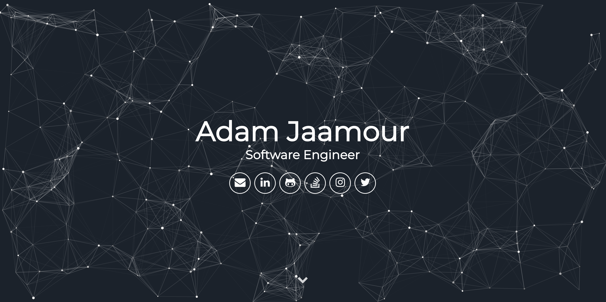

My Portfolio Website
=======================

This is a one-page mobile-friendly website powered by Jekyll that I use to act as an interactive online CV. It contains my programming skills, education, work experiences and online projects.

You can visit the website live here: [www.adam.jaamour.com](http://www.adam.jaamour.com/)

## Screenshots



## Download

* **[v2.6](https://github.com/Adamouization/Adamouization.github.io/releases/tag/v2.6) (19/05/2024)**
* [v2.5](https://github.com/Adamouization/Adamouization.github.io/releases/tag/v2.5) (04/02/2024)
* [v2.4](https://github.com/Adamouization/Adamouization.github.io/releases/tag/v2.4) (13/12/2023)
* [v2.3](https://github.com/Adamouization/Adamouization.github.io/releases/tag/v2.3) (11/05/2023)
* [v2.2](https://github.com/Adamouization/Adamouization.github.io/releases/tag/v2.2) (17/07/2022)
* [v2.1](https://github.com/Adamouization/Adamouization.github.io/releases/tag/v2.1) (14/10/2020)
* [v2.0](https://github.com/Adamouization/Adamouization.github.io/releases/tag/v2.0) (26/05/2020)
* [v1.3](https://github.com/Adamouization/Adamouization.github.io/releases/tag/v1.3) (25/05/2020)
* [v1.2](https://github.com/Adamouization/Adamouization.github.io/releases/tag/v1.2) (06/01/2020)
* [v1.1](https://github.com/Adamouization/Adamouization.github.io/releases/tag/v1.1) (19/09/2019)
* [v1.0](https://github.com/Adamouization/Adamouization.github.io/releases/tag/v1.0) (01/08/2019)

## Local Usage

How to run the website locally.

* [Install Jekyll](https://jekyllrb.com/docs/installation/)

* Clone the repository (or download the zipped project):
```
$ git clone https://github.com/Adamouization/Adamouization.github.io
```

* Move in the directory and install the dependencies specified in the Gemfile:

```
bundle install
```

* Compile and run the website:
```
bundle exec jekyll serve --watch
```

* Visit the website on `127.0.0.1:4000`

## To Do
* see [TODO - Initial Release](https://github.com/Adamouization/Adamouization.github.io/projects/1) file.
* see [TODO - Future Releases](https://github.com/Adamouization/Adamouization.github.io/projects/3) file.

## License 
* see [LICENSE](https://github.com/Adamouization/Adamouization.github.io/blob/master/LICENSE) file.

## Contact
* Email: adam[at]jaamour[dot]com
* Linktree: [linktr.ee/adamouization](https://linktr.ee/adamouization)
* LinkedIn: [linkedin.com/in/adamjaamour](https://www.linkedin.com/in/adamjaamour/)
